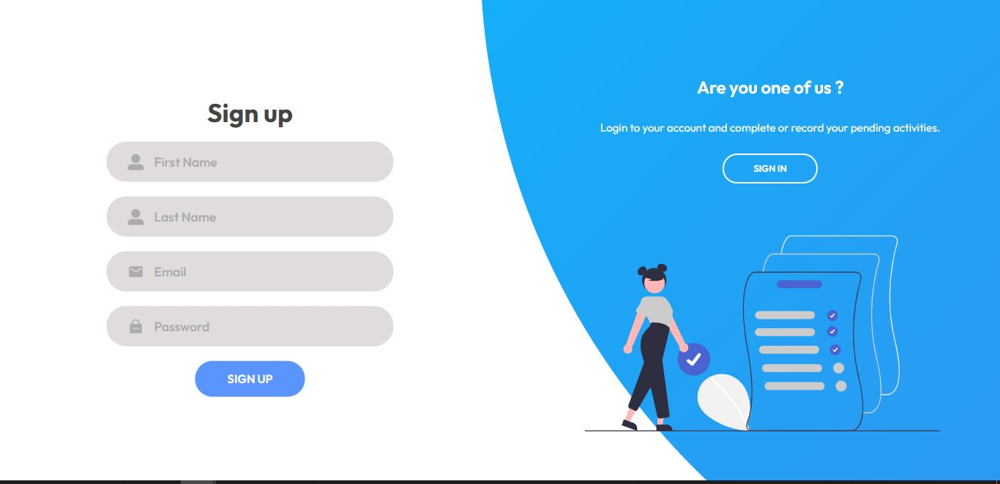

# TO DO LIST

## Introduction

It is a full Stack project where authentication and authorization are practiced to be able to navigate the page.

## About

It consists of an app where you can list your tasks and save them in files to have a better order. You can delete, edit or add tasks as files.

## Stack of Technologies

### Front End:

HTML, CSS, Javascript, React, Redux.

### Back End:

Express, Node JS, JWT, pcrypt, sequelize, PostSQL.

## **Starting Instructions**

### BoilerPlate

The boilerplate has two folders: `api` and `client`. In these folders will be the code of the back-end and the front-end respectively.

In `api` you should to create a file called: `.env` that's has the following form:

```
DB_USER=userPostgres
DB_PASSWORD=passwordPostgres
DB_HOST=localhost
JWT_SECRET=jwtsecret
```

Replace `userPostgres` and `passwordPostgres` with your own credentials to connect to postgreSQl.

Replace `jwtsecret` with the key you want.

Additionally, it will be necessary to create a database from psql called: `todos`

Realizar:

- In `api` file:

```
npm install / yarn add
```

- In `client` file:

```
npm install / yarn add
```

The `api` file has as local path "localHost:3001" and the `client` file as local path "localHost:3000".

- In `api` file:

```
npm run dev / yarn run dev
```

- In `client` file:

```
npm start / yarn start
```

to run the application.

## Account to Enter

```
email: usuario@usuario.com
password: password1234
```

# Project screens

- SigIn
<p align = "center">  </p>

- SigUp
<p align = "center">  </p>

- Home
<p align = "center">  </p>


